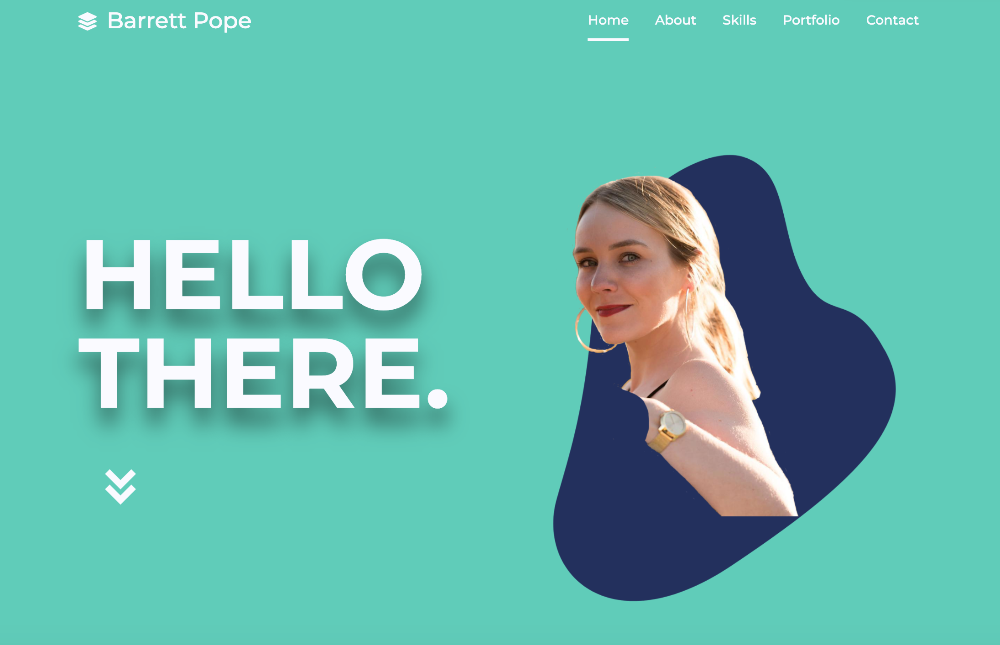

# Portfolio

## Table of Contents

- [Description](#description)
- [Visuals](#visuals)
- [Deployment](#deployment)
- [Contributing](#contributing)
- [Support](#support)

## Description

A user-friendly and mobile-first portfolio site that showcases my recent projects, supplies users with relevant information and features an all-encompassing contact section with a fully functioning form.

## Visuals

## Deployment

https://barrettpope.github.io/Portfolio/

## Contributing

Pull requests are welcome. For major changes, please open an issue first to discuss what you would like to change.

## Support

For questions, comments or concerns regarding this application, please email barrettpope94@gmail.com.
